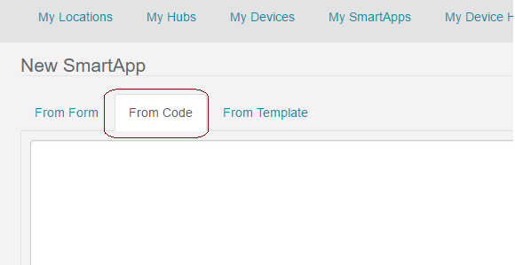
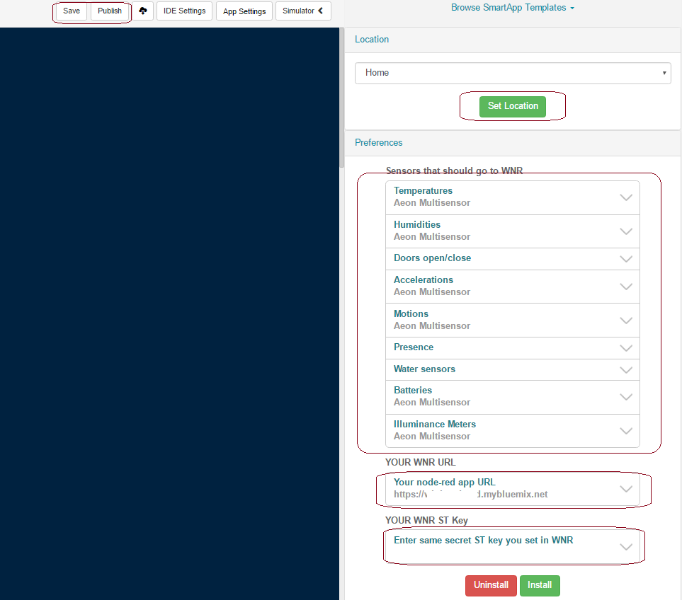
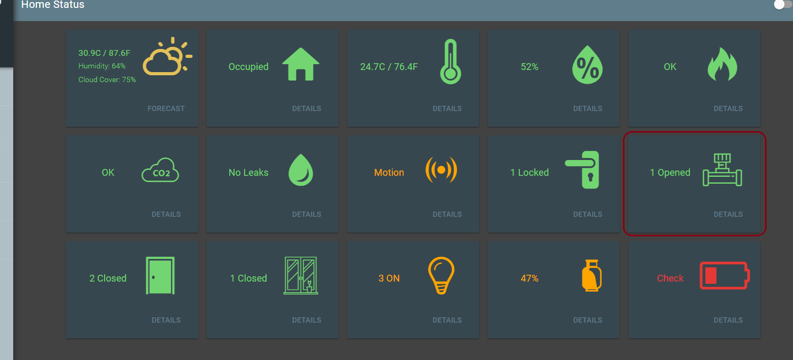
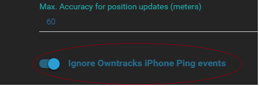
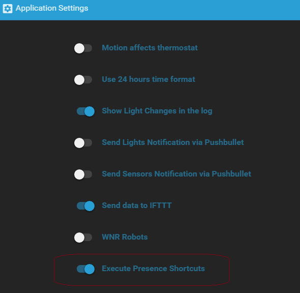
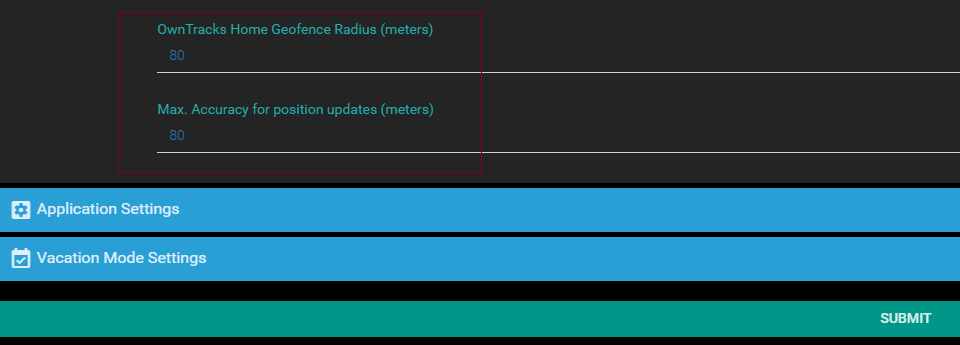
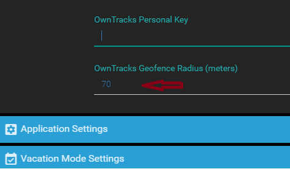
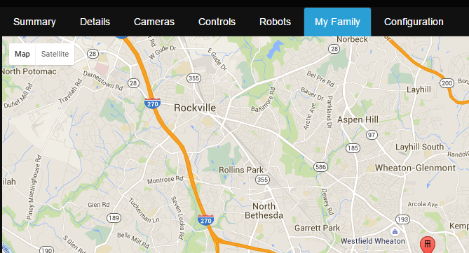
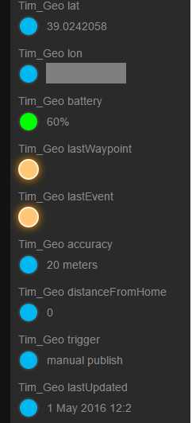

== Main app pages ==
-
https://(your_app_name).mybluemix.net/freeboard/ui - main UI page 
https://(your_app_name).mybluemix.net/freeboard/winkboard - sample freeboard 1 
https://(your_app_name).mybluemix.net/freeboard/winkboardautogroup - sample freeboard  

UI 2.0
https://(your_app_name).mybluemix.net/wnrUI  
== UPDATE ==
-
-
08/22/2016
------------
#####SmartThings to Node Red integration for Sensors
This update starts new chapter in WNR. SmartThings integration.
First drop will allow sensor data from SmartThings hub to be avaliable in WNR.  
Required steps (WNR)
*  Import updated [winkIntegration.json](winkIntegration.json)
*  Import updated [tabletUI.json](tabletUI.json)
*  perform "FULL" deployment 

Bluemix git console: 
*  re-deploy application in git 
* Open UI version 1, navigate to configuration tab/Integration settings, find "SmartThings Secret key" line and put some random string (you can use https://www.random.org/strings/)

Required steps (SmartThings):
* You need to open SmartThings management page (https://graph.api.smartthings.com/)
* Navigate to "My SmartApps" page and click on "add smart app" button, select "from Code"

* Open folloeing link [WNR Poster](../../SmartThings/httpPoster.groovy) and copy all code to the "code" section
* Click on "save" and "publish" " for me"

* then on the right side - select you Location, devices and actions that should go to Wnr
* at the bottom you need to populate your WNR url
* populate same SmartThings secret key that you entered in WNR configuration
* click Install

Once events start happening on ST side - data will flow to WNR so do not expect to see all devices immediately.

08/01/2016
------------
#####Added LeakSmart valves data to summary page (wnr UI 2.0 and 1.0)

Flow Editor: 
*  Import updated [winkCore.json](winkCore.json)
*  Import updated [winkIntegration.json](winkIntegration.json)
*  Import updated [tabletUI.json](tabletUI.json)
*  do not forget to check [duplicate websockets](../../README-WebsocketFix.md)
*  perform "FULL" deployment 

Bluemix git console: 
*  re-deploy application in git 

07/31/2016
-----------
URL for wink API index has been changed after it was not accessible for some time last week
I updated winkIntegration flow so it should work again.

Flow Editor: 
*  Import updated [winkIntegration.json](winkIntegration.json)
*  perform "FULL" deployment 

07/30/2016
------------
####winkCore - added valve commands.
* use context.global.executeWinkCMD(winkname,type,cmd,level) function with following paramteres:
	* winkname - LeakSmart Valve Name (user proper case as in wink app)
	* type - 'valve'
	* cmd:
		* 'open' - this will open valve
		* 'close' - this will close valve 

####winkCore - added advanced lock commands.
* use context.global.executeWinkCMD(winkname,type,cmd,param) function with following paramteres:
	* winkname - Wink Lock Name (user proper case as in wink app)
	* type - 'lock'
	* cmd:
		* 'vacation_mode' - this will enable/disable vacation mode
			* param = "true" or "false"
		* 'beeper' - this will enable/disable beeper
			* param = "true" or "false"
		* 'auto_lock' - this will enable/disable auto lock
			* param = "true" or "false"
		* 'alarm' - this will activate lock alarm mode
			* param = "null", "activity", "tamper", "forced_entry"

Flow Editor: 
*  Import updated [winkCore.json](winkCore.json)
*  do not forget to check [duplicate websockets](../../README-WebsocketFix.md)		
*  perform "FULL" deployment 

-
07/21/2016
-----------
It seems I missed documentation on how to use fadein/out/pulse effect commands inside node-red robots/schedules

fade in/fade out:
mycmd= context.global.executeEffectCMD(effect,winkName,winkType,min,max,period);

parameters :

	'effect': 'fadein','fadeout'
	'winkName': dimmable light name or group name
	'winkType': 'light' or 'group'
	'min': min brightness (0-100)
	'max': max brightness (0-100)
	'period' : effect period in seconds
	
pulse:
mycmd= context.global.executeEffectCMD(effect,winkName,winkType,min,max,period,repeat,delay);

parameters :

	'effect': 'pulse'
	'winkName': dimmable light name or group name
	'winkType': 'light' or 'group'
	'min': min brightness (0-100)
	'max': max brightness (0-100)
	'period' : put null or 0
	'repeat' : 'number of "pulses"
	'delay' : delay between "pulse" in seconds

then as usual type
	node.send(mycmd);

07/12/2016
-----------
Wink changed it's api server name and I probably missed it but today old server stopped working due to expired certificate
Please update winkCore flow
Flow Editor: 
*  Import updated [winkCore.json](winkCore.json)
*  Import updated [winkIntegration.json](winkIntegration.json)
*  do not forget to check [duplicate websockets](../../README-WebsocketFix.md)
*  perform "FULL" deployment 

06/24/2016
------------
#####Milestone for WNR UI 2.0
controls are functional both directions. (no garage doors, robots and groups for this release) 
Flow Editor: 
*  Import updated [winkCore.json](winkCore.json)
*  Import updated [winkIntegration.json](winkIntegration.json)
*  Import updated [tabletUI.json](tabletUI.json)
*  do not forget to check [duplicate websockets](../../README-WebsocketFix.md)
*  perform "FULL" deployment 

Bluemix git console: 
*  re-deploy application in git 

06/23/2016
------------
Node-Red core 0.14.3 has been released.
There are some changes in flow UI/ some new nodes, etc.
In order to move to this new version - update your  [package.json](package.json) and re-deploy app in BlueMix git. 
for local installations - you just need to follow instructions from http://nodered.org/docs/getting-started/upgrading.html
This update will also bring you new UI 2.0 version. Still early preview and not fully functional.

06/21/2016
------------
###Added missed command for supported thermostats to set users_away
#####Usage in robots/schedules
it is similar to other commands: 
mycmd= context.global.executeTstatCMD(TstatName,command,extra parameter);

commands :

	'mode' 
	extra parameter : 'heat_only' , 'cool_only' , 'auto' (if your model permits this)

	'heat_start_at'
	extra parameter : temp in celcius, you can use context.global.F2C(temp in F) - min temp when tstat starts heating

	'cool_start_at' 
	etra parameter : temp in celcius, you can use context.global.F2C(temp in F) - max temp when tstat starts cooling

	'powered'
	extra_parameter : 'on' , 'off'
	
	'users_away'
	extra_parameter : 'true' , 'false'
	
Flow Editor: 
*  Import updated [winkCore.json](winkCore.json)
*  do not forget to check [duplicate websockets](../../README-WebsocketFix.md)
*  perform "FULL" deployment 

06/09/2016
------------
#####winkCore - added schedules to controls/robots tab.
* use context.global.executeWinkCMD(winkname,type,cmd) function with following paramteres:
	* winkname - Robot or Schedule name (user proper case as in wink app)
	* type - 'robot'
	* cmd - 'enable'/'disable' 

Flow Editor:
*  Import updated [winkCore.json](winkCore.json)
*  do not forget to check [duplicate websockets](../../README-WebsocketFix.md)		
*  perform "FULL" deployment 

06/04/2016
------------
####winkCore - added siren commands.
* use context.global.executeWinkCMD(winkname,type,cmd,level) function with following paramteres:
	* winkname - siren name (user proper case as in wink app)
	* type - 'siren'
	* cmd:
		* 'siren_only', 'strobe_only', 'siren_and_strobe' - this will turn siren on in one of the modes
		* 'off' - this will turn siren off
		* 'auto_shutoff' this will set auto shutoff. for this cmd type specify one of the following values using level parameter:
			* null (manual shutdown), 30 , 60, 120 seconds to autoshutdown siren. This is a configuation command so you probably will never use it but if you do - make sure you know what you want.

Flow Editor: 
*  Import updated [winkCore.json](winkCore.json)
*  do not forget to check [duplicate websockets](../../README-WebsocketFix.md)		
*  perform "FULL" deployment 

05/27/2016
------------
###Owntracks: Added ability to ignore iPhone ping events.
* Navigate to configuration/Applicationsettings ignore iPhonePing switch (turned off by default) 

Flow Editor: 
*  Import updated [winkIntegration.json](winkIntegration.json)
*  Import updated [tabletUI.json](tabletUI.json)

###Added command that can be used in Robots to adjust theromstat settings: 
#####Usage in robots/schedules
it is similar to other commands: 
mycmd= context.global.executeTstatCMD(TstatName,command,extra parameter);

commands :

	'mode' 
	extra parameter : 'heat_only' , 'cool_only' , 'auto' (if your model permits this)

	'heat_start_at'
	extra parameter : temp in celcius, you can use context.global.F2C(temp in F) - min temp when tstat starts heating

	'cool_start_at' 
	etra parameter : temp in celcius, you can use context.global.F2C(temp in F) - max temp when tstat starts cooling

	'powered'
	extra_parameter : 'on' , 'off'	
	
Flow Editor: 
*  Import updated [winkCore.json](winkCore.json)
*  do not forget to check [duplicate websockets](../../README-WebsocketFix.md)
*  perform "FULL" deployment 

05/07/2016
------------
* Presence automation additions:
* Option to turn on/off auto execution of wink shortcuts for Presence.
	* Navigate to configuration/Applicationsettings and Look for Execute presence shortcuts switch (turned on by default) 

Flow Editor: 
*  Import updated [winkIntegration.json](winkIntegration.json)
*  Import updated [tabletUI.json](tabletUI.json)

05/05/2016
------------
* Owntracks additions:
* WNR defined home geofence radious is displayed on the map.
* Enhancements to presence detection and shortcut execution (owntracks region transitions are turned on).
* Navigate to configuration/Integration settings and scroll down to OwnTracks section and define your geofence radius. and accuracy threshold which will prevent "bad" location data to flow in 

* click "submit"

Flow Editor: 
*  Import updated [winkIntegration.json](winkIntegration.json)
*  Import updated [tabletUI.json](tabletUI.json)

05/04/2016
------------
* Owntracks additions:
* Added WNR defined geo-radius.
* Enhancements to presence detection and shortcut execution.

Flow Editor: 
*  Import updated [winkIntegration.json](winkIntegration.json)
*  Import updated [tabletUI.json](tabletUI.json)

* Navigate to configuration/Integration settings and scroll down to OwnTracks section and define your geofence radius. 

* click "submit"

#####Presence shortcut support:
To avoid future confusion you need to define following wink shortcuts: 
* PRESENCE DAY / PRESENCE NIGHT - these will be executed when global presence status will change to true(somebody arrived) before sunset/after sunset 
* NO PRESENCE DAY / NO PRESENCE NIGHT - these will be executed when global presence status will change to false (everybody left) before sunset/after sunset 
	

05/01/2016
------------
* Added support for OwnTracks app with HTTP mode. (IOS supported currently, Android is on the way)
* Fixed Presence clearing bug.

Flow Editor: 
*  Import updated [winkIntegration.json](winkIntegration.json)
*  Import updated [tabletUI.json](tabletUI.json)

Bluemix git console: 
*  re-deploy application 

##### Setting up OwnTracks support:
* Navigate to configuration tab in tablet ui, and Look for OwnTracks Personal Key entry in Integration Settings

* Enter random Aplha-numeric only string _no special symbols_. You can use following [Random String Generator](https://www.random.org/strings/?num=1&len=7&digits=on&upperalpha=on&loweralpha=on&unique=on&format=html&rnd=new)
* Click Submit button to save it.
* Get OwnTracks application from app store on your phone.
* Configure Owntracks app using [OwnTracks readme](owntracks.md)
* Re-load Tablet UI (refresh browser) and if everything worked, you should have new tab _My Family_  where you will see your home marker, and markers for each sensor you add (just first letter so make then unique)

* and new data in details tab on MultiSensor panel. 

* _Presence_ will be automatically added to sensors list if you configure OwnTracks region.

04/16/2016
------------
Clear nonWink devices and Presence entries from cache.
New settings added to configuration tab/application settings 
  
Select one relevat to you and click "submit" button. Refresh browser after that.

Flow Editor: 
*  Import updated [winkCore.json](winkCore.json)
*  Import updated [tabletUI.json](tabletUI.json)
*  do not forget to check [duplicate websockets](../../README-WebsocketFix.md)
*  perform "FULL" deployment 

04/14/2016
------------
####Bloomsky:

Updated Bloomsky integration such that the UI will show the latest image from Bloomsky, without needing to refresh the browser.
Flow Editor: 
*  Import updated [winkIntegration.json](winkIntegration.json)
*  perform "Modified Nodes" deployment 
 

####Blink Cameras:

Integration with Blink Home Cameras now live! If you have Blink cameras, your cameras can now show up in the Camera tab of the UI and the temperature data shows up in the sensors. Flow Editor: 
*  Import [Blink.json](Blink.json)
*  Update "Define e-mail and password" node with your Blink username and password.
*  Perform "Modified Nodes" deployment 

04/09/2016
------------
Old or "deleted" wink devices are not shown anymore.
Flow Editor: 
*  Import updated [winkCore.json](winkCore.json)
*  do not forget to check [duplicate websockets](../../README-WebsocketFix.md)
*  perform "FULL" deployment 

Small updates:
04/08/2016
------------
Small updates:
* fixed https://github.com/tfatykhov/WinkRedNode/issues/45 raised issue with camera image cropping.
* added function to save camera snapshots in robotos/schedules: 
		usage: node.send(context.global.saveCameraSnapshot(camera_name,event_name); 
			camera_name can be a single camera, example 'BasementCam' or list of cameras separated by comma - 		'BasementCam,DeckCam' 

Flow Editor: 
*  Import updated [winkCore.json](winkCore.json)
*  Import updated [tabletUI.json](tabletUI.json)
*  do not forget to check [duplicate websockets](../../README-WebsocketFix.md)
*  perform "FULL" deployment 

03/31/2016
------------
Color change for supportted bulbs in ui including apple support :)
  

<b>You still need to perform git console steps from previous update (03/30/2016) unless you aready done this.</b>

Bluemix git console: 
*  re-deploy application in git 

Flow Editor: 
*  Import updated [tabletUI.json](tabletUI.json)
*  do not forget to check [duplicate websockets](../../README-WebsocketFix.md)
*  perform "FULL" deployment 

03/30/2016
------------
Color change for supportted bulbs in ui

  
* usage in scripts: 
var color=context.global.tinycolor("red"); 
executeWinkCMD("light name","light","color",color.toHex()); 

List of color names -  
https://www.w3.org/TR/css3-color/#svg-color 

you can use hex value without leading # directly: 
executeWinkCMD("light name","light","color","FF0000");  
<b>This command will only changes bulb color. You need to execute "power on" command first</b> 
 
Bluemix git console: 
*  copy contents of [package.json](package.json) and update same file in your configuration with it contents.
*  add following line to the bluemix-settings.js inside functionGlobalContext section 
	*       ,tinycolor : require("tinycolor2").  refer to [sample bluemix-settings.js](bluemix-settings.js)
*  re-deploy application in git 

Flow Editor: 
*  Import updated [winkCore.json](winkCore.json)
*  Import updated [winkIntegration.json](winkIntegration.json)
*  Import updated [tabletUI.json](tabletUI.json)
*  do not forget to check [duplicate websockets](../../README-WebsocketFix.md)
*  perform "FULL" deployment 

03/20/2016
------------
* small bug fixes
* WNR robots on/off switch in configuration/application settings
 
Flow Editor: 
*  Import updated [winkIntegration.json](winkIntegration.json)
*  Import updated [tabletUI.json](tabletUI.json)

03/13/2016
------------
BloomSky integration
entry for the api key added to config tab 
  
After update you should see BloomSky Data in MultiSensor section on Details tab:
 

You will also see latest sky image on cameras tab. Screenshots/history also works

Flow Editor: 
*  Import updated [winkCore.json](winkCore.json)
*  Import updated [winkIntegration.json](winkIntegration.json)
*  Import updated [tabletUI.json](tabletUI.json)
*  do not forget to check [duplicate websockets](../../README-WebsocketFix.md)
*  perform "FULL" deployment 

Bluemix git console: 
*  re-deploy application 

You can use following global variables:

context.global.Weather.Bloomsky:{ 
			"Rain": false, 
			"Night": false, 
			"Luminance": 3455, 
			"Humidity": 38, 
			"Pressure": 991, 
			"UVIndex": "1", 
			"TemperatureC": 15.95, 
			"TemperatureF": 61 
}

03/13/2016
------------
* Added config option to turn data flow to IFTTT.
* Added some help pages for configuration tabs. 
  
 

Flow Editor: 
*  Import updated [winkCore.json](winkCore.json)
*  Import updated [winkIntegration.json](winkIntegration.json)
*  Import updated [tabletUI.json](tabletUI.json)
*  do not forget to check [duplicate websockets](../../README-WebsocketFix.md)
*  perform "FULL" deployment 

03/11/2016
------------
Vacation mode small update:
* binary switches are in the list
* color scheme changes for config pages 
 

Flow Editor: 
*  Import updated [tabletUI.json](tabletUI.json) 
*  perform "Modified Flows" deployment 

03/11/2016
------------
Vacation mode additions:
* Supported locks will turn vacation mode.
* Supported locks will activate tamper alarm.
* If presence is configured - Presence can turn vacation mode off automatically (stop random lights effect). Lock mode has to be changed manually back to normal.
* Selected light bulbs (including LIFX) will be randomly set to on, off or dim between sunset hour and 1 a.m 

 

Required changes: 
Bluemix git console: 
*  re-deploy application 

Flow Editor: 
*  Import updated [winkCore.json](winkCore.json)
*  Import updated [winkIntegration.json](winkIntegration.json)
*  Import updated [tabletUI.json](tabletUI.json)
*  Import updated [blueIris.json](blueIris.json)
*  do not forget to check [duplicate websockets](../../README-WebsocketFix.md)
*  perform "FULL" deployment 

03/06/2016
------------
* Added buttons to summary page to activate/deactivate Schedules and Vacation Mode. 
* 
 

* Vacation mode is a first drop so no random lights yet but it will turn on phone notification for all connected devices via pushbullet irregadles of manual settings and when motion is detected every camera in the app will automatically take a snapshot. I will continue to work on additional settings but it takes more time than I thought.
* Fixes for blueIris to remove error message

Required changes: 
Bluemix git console: 
*  re-deploy application 

Flow Editor: 
*  Import updated [winkCore.json](winkCore.json)
*  Import updated [winkIntegration.json](winkIntegration.json)
*  Import updated [tabletUI.json](tabletUI.json)
*  Import updated [blueIris.json](blueIris.json)
*  do not forget to check [duplicate websockets](../../README-WebsocketFix.md)
*  perform "FULL" deployment 

03/04/2016
------------
* Garage doors are back for robots but still disabled in UI. 
* Per request from a user, added mobile push notifications (same as ui) via pushbullet. In order to set this up you will need pushbullet API key which you can easily get. Just go to pushbullet.com, create or log in to your account, then navigate to Settings - Account, scroll down until you will see "generate Access token" button. 
 
Copy the value and add it to the config tab "Pushbullet key" 
 
As you can see config tab is re-designed a bit. so open "Apllication Settings" section and check what do you want to send to the phone  
 Then click "submit" 

Flow Editor: 
*  Import updated [winkCore.json](winkCore.json)
*  Import updated [winkIntegration.json](winkIntegration.json)
*  Import updated [tabletUI.json](tabletUI.json)
*  do not forget to check [duplicate websockets](../../README-WebsocketFix.md)
*  perform "FULL" deployment 

02/24/2016
-----------------
<b>This update only required if you have WInk API key/Secret. If not, this update today not required</b> 
Ability to provide your own Wink API key/secret pair. Since we have temp throttling by wink (several days to make sure everything works OK) I added ability to populate your own WINK key which you can request through wink support site 
[Wink Support](https://wink.zendesk.com/hc/en-us/requests/new) 

Navigate to tab ui/configuration page and enter Client ID and Secret provided by Wink. 
 

Click Submit and then Refresh Wink Data. After this your node-red will use your own Key.
Flow Editor: 
*  Import updated [winkCore.json](winkCore.json)
*  Import updated [winkIntegration.json](winkIntegration.json)
*  Import updated [tabletUI.json](tabletUI.json)
*  do not forget to check [duplicate websockets](../../README-WebsocketFix.md)
*  perform "FULL" deployment 

02/23/2016 
-----------------
After an issue yesterday I had to request new api keys for node-red project as well as make some additional filtering to prevent wink server overflowing. Latest changes have been applied at 5:05 P.M on 02/23/2016:

<b>Required changes or app will not function if you updated flows before 5:05 P.M on 02/23/2016 you need to re-deploy winkCore flow </b> 
Bluemix git console: 
*  copy contents of [package.json](package.json) and update same file in your configuration with it contents.
*  add following line to the bluemix-settings.js inside functionGlobalContext section 
	*   ,wnr : require("winknodered"). refer to [sample bluemix-settings.js](bluemix-settings.js)
*  re-deploy application in git 

Flow Editor: 
*  Import updated [winkCore.json](winkCore.json)
*  Import updated [winkIntegration.json](winkIntegration.json)
*  Import updated [tabletUI.json](tabletUI.json)
*  do not forget to check [duplicate websockets](../../README-WebsocketFix.md)
*  perform "FULL" deployment 

02/22/2016
-----------------
We had an issue earlier today when because of some fault device one of node-red application overflooded wink servers with data so I added a throttling mechanism that will prevent excessive messages to wink servers to 1 per second otherwise they can temorarely suspend access. 
<b>please perform ASAP</b>
Flow Editor: 
*  Import updated [winkCore.json](winkCore.json)
*  Import updated [winkIntegration.json](winkIntegration.json)
*  Import updated [tabletUI.json](tabletUI.json)
*  do not forget to check [duplicate websockets](../../README-WebsocketFix.md)
*  perform "FULL" deployment 

02/21/2016
----------------
Bug fixes (robots formatting issue, etc.) <b>Please import first 3 flows even if you do not need blue Iris</b> 
Added support for [Blue Iris](http://blueirissoftware.com) 
Please use instructions for Blue Iris on how to set up access from outside your home network.
Once you set it up you need to know following:
* HTTPS will not be supported unless you get proper signed certificate. Blue Mix does not like self signed ones
* you need to turn off "secure only" option since it is not that secure anyway. Blue mix will not expose uid/pwd on the UI and will get image redirected through it servers and will deliver to user endpoint via HTTPS. 
 

I recommend to get some dynamic dns name for this or you will have to change host name if your provide ip address will change.
Once you configure Blue Iris, you need to:

Flow Editor: 
*  Import updated [winkCore.json](winkCore.json)
*  Import updated [winkIntegration.json](winkIntegration.json)
*  Import updated [tabletUI.json](tabletUI.json)
*  Create new tab and import new [blueIris.json](blueIris.json)
*  do not forget to check [duplicate websockets](../../README-WebsocketFix.md)
*  perform "FULL" deployment 

Once you deployed and app reinitialized navigate to config tab of tablet ui and enter following info:

* host name should be in a form of http://you blue iris ip or host name:port (no backslash at the end)
* click on "refresh wink data" Once it is done - you should see your cameras in "cameras" tab.

You can also configure motion alerts to be routed to node-red and then being used in robots/notification/etc.
In Blue Iris software - navigate to camera settings/alerts

check "request from web service" and click configure. 
On next screen you need to put following things:

* url - should be your bluemixapp.winknodered.net/red/blueiris/alerts/Your camera Short Name from BlueIris
* post text: {"motion":"true"}
* Make same entries for "request again when trigger is reset" but in this case populate {"motion":"false"} in the post text.
	* I did not test that option so please let me know if it works or not.
You should be all set. 

02/20/2016
----------------
I noticed some updates in wink API which did not happen before.
They are minor but mostly ui summary and controls page are affected in terms of status is not set properly all the time for lights and binary switches.
Flow Editor: 
*  Import updated [winkCore.json](winkCore.json)
*  do not forget to check [duplicate websockets](../../README-WebsocketFix.md)
*  perform "FULL" deployment 

02/19/2016
----------------
Added manual snaphsot button for each camera:

Added new global object <b>sunTimes</b> to use in schedules/robots/etc. it has following values:
* sunrise	- sunrise (top edge of the sun appears on the horizon)
* sunriseEnd	- sunrise ends (bottom edge of the sun touches the horizon)
* goldenHourEnd	- morning golden hour (soft light, best time for photography) ends
* solarNoon	- solar noon (sun is in the highest position)
* goldenHour	- evening golden hour starts
* sunsetStart	- sunset starts (bottom edge of the sun touches the horizon)
* sunset	- sunset (sun disappears below the horizon, evening civil twilight starts)
* dusk		- dusk (evening nautical twilight starts)
* nauticalDusk	- nautical dusk (evening astronomical twilight starts)
* night		- night starts (dark enough for astronomical observations)
* nadir		- nadir (darkest moment of the night, sun is in the lowest position)
* nightEnd	- night ends (morning astronomical twilight starts)
* nauticalDawn	- nautical dawn (morning nautical twilight starts)
* dawn		- dawn (morning nautical twilight ends, morning civil twilight starts)
* sunset_m_1	- sunset minus one hour 
Each attribute has 2 values: hour and minute

so if you want to get values for dawn you need to address it as: 
* context.global.sunTimes.dawn.hour
* context.global.sunTimes.dawn.minute

Required changes: 
Bluemix git console: 

*  copy contents of [package.json](package.json) and update same file in your configuration with it contents.
*  add following line to the bluemix-settings.js inside functionGlobalContext section 
	*  ,SunCalc : require("suncalc"). refer to [sample bluemix-settings.js](bluemix-settings.js)
*  restart application 

Flow Editor: 
*  Import updated [winkCore.json](winkCore.json)
*  Import updated [winkIntegration.json](winkIntegration.json)
*  Import updated [tabletUI.json](tabletUI.json)
*  do not forget to check [duplicate websockets](../../README-WebsocketFix.md)
*  perform "FULL" deployment 

02/15/2016 part.2
----------------
Added garage doors to controls tab under Locks and Doors section 
Flow Editor: 
*  Import updated [winkCore.json](winkCore.json)
*  Import updated [tabletUI.json](tabletUI.json)
*  do not forget to check [duplicate websockets](../../README-WebsocketFix.md)
*  perform "FULL" deployment 

02/15/2016
----------------
Added separate "Robots" tab where you can check status and enable/disable them.

Garage doors should work now:

New Command types for IFTTT and internal use 
Check  [HOWTO - IFTTT](../../README-IFTTT.md#send-wink-device-cmd-via-ifttt-new) for instructions  

Flow Editor: 
*  Import updated [winkCore.json](winkCore.json)
*  Import updated [winkIntegration.json](winkIntegration.json)
*  Import updated [tabletUI.json](tabletUI.json)
*  do not forget to check [duplicate websockets](../../README-WebsocketFix.md)
*  perform "FULL" deployment 

02/14/2016 v2 11pm Eastern
----------------
Updated the "Standardize for robots" node on winkCore to allow for triggering Wink Node Red robots when a Wink app robot fires

Flow Editor: 
*  Import updated [winkCore.json](winkCore.json)
*  perform "FULL" deployment 
*  do not forget to check [duplicate websockets](../../README-WebsocketFix.md) 
  

02/14/2016
----------------
New icons for door/windows/cabinets and garage (not tested since I do not have this device)

Bluemix git console: 

*  restart application 

Flow Editor: 
*  Import updated [winkCore.json](winkCore.json)
*  perform "FULL" deployment 
*  do not forget to check [duplicate websockets](../../README-WebsocketFix.md) 

02/13/2016
-----------------
Ring door bell notifications shown in the log and in dashboard 

Flow Editor: 
*  Import updated [winkCore.json](winkCore.json)
*  perform "FULL" deployment 
*  do not forget to check [duplicate websockets](../../README-WebsocketFix.md) 

02/12/2016
-----------------
New light effects for IFTTT/Tasker/etc  [HOWTO - IFTTT](../../README-IFTTT.md#fadeinfadeoutpulse-effects-for-dimmable-lights-and-groups) 

new custom page tab - navigate to config and add Label and url: 

refresh browser window 

Flow Editor: 
*  Import updated [winkIntegration.json](winkIntegration.json)
*  Import updated [tabletUI.json](tabletUI.json)
*  perform "Modified Flows" deployment 

02/09/2016
----------------
Added forecast(just click on current conditions weather icon) 

Added ability to call PRESENCE / NO PRESENCE shortcuts during day (before sunset) and 
PRESENCE NIGHT / NO PRESENCE NIGHT after sunset and before sunrize 
Flow Editor: 
*  Import updated [winkCore.json](winkCore.json)
*  Import updated [winkIntegration.json](winkIntegration.json)
*  Import updated [tabletUI.json](tabletUI.json)
*  perform "FULL" deployment 

02/08/2016
----------------
Added ability to set/change global variable via ifttt 
Added home occupancy icon based on Node-Red Presence 

Bluemix git console: 

*  restart application 

Flow Editor: 
*  Import updated [winkCore.json](winkCore.json)
*  Import updated [winkIntegration.json](winkIntegration.json)
*  Import updated [tabletUI.json](tabletUI.json)
*  perform "FULL" deployment 

Check  [HOWTO - IFTTT](../../README-IFTTT.md) for instructions on how to set variable in node-red via IFTTT (last section of the document).  

Check [HOWTO - Presence](../../README-PresenceIntegration.md) for examples on how to set up Presence in Wink Node-Red 
you can also use IFTTT wifi connected/disconnected in case of Android or IFTTT location instead of Life365 as THIS in recipe.  
You can also use Tasker or similar software that can make an HTTPS POST call.

02/07/2016
----------------
Imrpoved wink data refresh functionality: 
now, when you click on the "refresh" button, ui will wait for data refresh to happen and then autorefresh itself 

Fixes and updates: 
Removed non-user created or empty robots from dashboards. 
Removed empty groups 
Fixed multi-sensors on "old" freeboards 
Flow Editor: 
*  Import updated [winkCore.json](winkCore.json)
*  Import updated [winkIntegration.json](winkIntegration.json)
*  import updated [Freeboards](winkFreeboards.json)
*  Import updated [tabletUI.json](tabletUI.json)
*  perform "FULL" deployment 

02/06/2016, v2
-----------------
Added ability to refresh wink Devices via UI

Flow Editor: 
*  Import updated [winkCore.json](winkCore.json)
*  Import updated [tabletUI.json](tabletUI.json)
*  perform "FULL" deployment 

02/06/2016
-----------------
Added ability to save custom freeboards to your local computer so you can re-load them again: 

Updated 'what changed' flow on winkCore to show occupancy and temp in *F 
Removed 'second ws instance' trying to avoid ws duplicate errors 
wink api should show 'retrieving' if it is not there yet. 
Issue with deployment on bluemix 
Added ability to show light status in the logs via config

Flow Editor: 
*  Import updated [winkCore.json](winkCore.json)
*  Import updated [winkIntegration.json](winkIntegration.json)
*  Import updated [tabletUI.json](tabletUI.json)
*  perform "FULL" deployment 

Bluemix git console: 

*  copy contents of [package.json](package.json) and update same file in your configuration with it contents.
*  restart application 

02/05/2016
-----------------
fixed - ifttt integration bug for shortcuts 
removed canary from camera page 
added canary status updates in event log 
trying to solve dup websockets 
wink api index added to summary page 
*  Import updated [winkCore.json](winkCore.json)
*  Import updated [tabletUI.json](tabletUI.json)
*  Import updated [winkIntegration.json](winkIntegration.json)

***NOTE: In this case, once you have imported all 3 tabs, make sure you do a FULL import***  

02/02/2016
-----------------
Tablet UI summary updates: refuel icon, more dynamic changes(try to trigger tripper :) ), bug fixes 

*  Import updated [winkCore.json](winkCore.json)
*  Import updated [tabletUI.json](tabletUI.json)
*  Import updated [winkIntegration.json](winkIntegration.json)

01/29/2016
-----------------
Moved to node.js version 4.x since it is more stable and have better performance and memory management 
* update package.json via git console of bluemix using [package.json](package.json)
* restart node-red app via blue-mix git

01/28/2016
------------------
Readme - how to use node-red and IFTT, how to config blue-iris to post to node-red 
[HOWTO - IFTTT](../../README-IFTTT.md) 
Added presence details to freeboards: 
Added automatic selection of websockets or http(s) get in case websockets are not supported for any reason 
*  import updated [tabletUI.json](tabletUI.json)
*  import updated [winkIntegration.json](winkIntegration.json)
*  import updated [Freeboards](winkFreeboards.json)   

01/25/2016
------------------
Readme - how to import/update flows to node-red
[Import/Update Flows](../../README-ImportingUpdating%20Flows.md)

01/23/2016
------------------
Tablet UI config page, added clock format change: 

Robots activity are now displayed in the activity log: 

Robots status added to "detais" tab. If you have more than 10, robots will be splitted in the chunks of 10 to proper fill screen space:  
 
Required changes: 
* update package.json via git console of bluemix using [package.json](package.json)
* Import updated [winkCore.json](winkCore.json)
*  import updated [tabletUI.json](tabletUI.json)
*  import updated [winkIntegration.json](winkIntegration.json)
*  restart your app via git dashboard or cf push. 
 
For local setup, to change time display add following key to settings.js under functionGlobalContext section 
,HoursFormat24:true (or false) based on your need. 

11/14/2015
------------------
Tablet UI config page, first drop: 

Required changes: 
* Import updated [winkCore.json](winkCore.json)
*  import updated [tabletUI.json](tabletUI.json)
*  import updated [winkIntegration.json](winkIntegration.json)
*  restart your app via git dashboard or cf push. 
This is for bliue-mix cloud instances only. If you are using local installation you will need to implement your own database connector.

11/14/2015
------------------
Found bug in tabletUI please import updated [tabletUI.json](tabletUI.json)

11/13/2015
------------------
Updated to Node-Red 0.12.X 
Node red had new release couple of days back and now it is version 0.12.x. and it introduced some changes to http nodes 
in order to make sure that latest version is used please  
* copy contents of [package.json](package.json) and update same file in your configuration with it contents.
* restart wink app via cf push or git dashboard
 
 
After restart 
*  Import updated [winkCore.json](winkCore.json)
*  import updated [tabletUI.json](tabletUI.json)
*  import updated [winkIntegration.json](winkIntegration.json)
*  import updated [Freeboards](winkFreeboards.json)   
Tablet UI summary page - small cosmetic fixes and battery notification if any batteries in your system is below 25%: 

11/9/2015
------------------
Tablet UI summary page: 

New summary page with "dashboard" style :) 
Required changes: 
* Import updated [winkCore.json](winkCore.json)
*  import updated [tabletUI.json](tabletUI.json)
*  import updated [winkIntegration.json](winkIntegration.json)
*  restart your app via git dashboard or cf push.

10/30/2015
------------------
Tablet UI notifications: 

Currently shows sensor info, battery info and more 
3 level of messages: 
1.	Alert - will stay until dismissed manually red box 
2.	Warning will stay for 60 seconds yellow box 
3.	Information will stau for 60 seconds blue box  
Required changes: 
* Import updated [winkCore.json](winkCore.json)
*  import updated [tabletUI.json](tabletUI.json)
*  import updated [winkIntegration.json](winkIntegration.json)
*  restart your app via git dashboard or cf push.

10/25/2015
------------------
Tablet UI updates: 
1. Shortcut buttons spinning wheel:
Required changes:
*  import updated [tabletUI.json](tabletUI.json)

10/23/2015
----------------
Tablet UI updates: 
1. Locks  added to control tab:

 
2. data exchange moved to websockes to reduce network traffic. With this change server pushes updates for control tab vs continious http gets.
 
 
Required changes:
*  import updated [tabletUI.json](tabletUI.json)
* Import updated [winkCore.json](winkCore.json)
*  restart your app via git dashboard or cf push.

10/18/2015
----------------
Tablet UI updates:

camera history shows in modal window and using carousel widget 

 
required changes: 
*  import updated [tabletUI.json](tabletUI.json)
*  restart your app via git dashboard or cf push.

10/12/2015
----------------
Tablet UI updates:
* new app icon. Please remove existing from home screen and add again. 

* new cameras page. 

 
*  import updated [tabletUI.json](tabletUI.json)
*  import updated [winkIntegration.json](winkIntegration.json)
*  restart your app via git dashboard or cf push.

10/12/2015
----------------
Tablet UI with new controls tab.

* add "crypto" module to bluemix-setting.json. First you need to add following line to the top section of the file: var crp = require("crypto");  
So your first 3 lines in the file  should look like this: 
	<b>var crp = require("crypto");</b> 
	var path = require("path"); 
	var when = require("when");<rb>

* You also need to update functionGlobalContext section and add following lines 
	,CRYPTO: crp 
* do CF push and restart the app.

* Import updated [winkCore.json](winkCore.json)
* Import updated [winkFreeboards.json](winkFreeboards.json) 
* Create new tab in flow editor and import new [tabletUI.json](tabletUI.json)

10/05/2015
-----------------
Updated with LIFX bulb support. 

Required changes:  
* Import updated [winkCore.json](winkCore.json)
* Import updated [winkIntegration.json](winkIntegration.json)
* Add the following to bluemix-settings.js into functionGlobalContext section: 
<code>
,"LIFX_TOKEN":"your LIFX token"
</code>

10/05/2015
-----------------
* Import updated [winkFreeboards.json](winkFreeboards.json) 
Now it has first draft of "controls" page.

10/05/2015
-----------------
New "tablet friendly" dashboard with configurable buttons (can be assigned to activate wink shortcut) 

Required changes:  
* Import updated  updated [winkCore.json](winkCore.json)
* Import updated [winkFreeboards.json](winkFreeboards.json)
* Import  updated [winkIntegration.json](winkIntegration.json)

Add following  to blumix-settings.js into functionGlobalContext section: 

<code>
,"tab_ui_shortcuts":["wink shortcut name","wink shortcut name","wink shortcut name","wink shortcut name","wink shortcut name","wink shortcut name"] 
</code>

replace <i>wink shortcut name</i> with actual shorcut names from wink app with same case. You can put 6 or less shorcuts.
If you put less, then unused buttons will have "shorctut #" label without any action for now. 
New tablet dashboard is accessible via: 
<code> your_app_name.mybluemix.net/freeboard/ui</code>

9/23/2015
-----------------
1. Dlink MJPEG cameras support (no motion detection reporting to dashboard) 
Following models should work <i>'DCS-930L','DCS-930' , 'DCS-931L','DCS-931', 'DCS-932L','DCS-932', 'DCS-933L','DCS-933', 'DCS-5020L','DCS-934L'</i> 
Please use camera documentation for steps, required to configure access to camera from internet. 

Required changes:  
* For Dlink - add following  to blumix-settings.js into functionGlobalContext section: 
,DlinkCam: { 
		"DCS934L" : {"hostname":"your ip:port","uid":"user id","pwd":"password","model":"DCS-934L"} 
	   } 
Add more cameras if you have them in similar way inside DlinkCam section 
Make sure model is set exactly as one from the list above 
* add new tab and import new [DlinkCam.json](DlinkCam.json) 

9/21/2015
-----------------
1. New cameras support - Dlink NIPCA series. Most should be able to report motion detection to dashboard and be used as triggers for IFTTT and snapshot recording 
Following models should work <i>DCS-1100(L), DCS-1130(L), DCS-2102, DCS-2103, DCS-2121, DCS-2130, DCS-2132L , DCS-2136L, DCS-2210, DCS-2230, DCS-2310L, DCS-2332L, DCS-3010, DCS-3112, DCS-3410, DCS-3411, DCS-3430, DCS-3710, DCS-3710 B1, DCS-3715, DCS-3716, DCS-5211L, DCS-5222L, DCS-5230L, DCS-5605, DCS-5635, DCS-6010L, DCS-6112(V), DCS-6113(V), DCS-6210, DCS-6314, DCS-6410, DCS-6510, DCS-6511, DCS-6513, DCS-6616, DCS-681x B1, DCS-6915, DCS-7010L, DCS-7110, DCS-7410, DCS-7413, DCS-7510, DCS-7513, DVS-310-1, DVS-V310-4, DCS-940L, DCS-942L</i> 
Please use camera documentation for steps, required to configure access to camera from internet. 
2. Bug fixes

Required changes:  
* For Dlink - add following  to blumix-settings.js into functionGlobalContext section: 
,DlinkCam: { 
		"DCS942L" : {"hostname":"your ip:port","uid":"user id","pwd":"password","model":"DCS-942L"} 
	   } 
Add more cameras if you have them in similar way inside DlinkCam section 
Make sure model is set exactly as one from the list above 
* add new tab and import new [DlinkCam.json](DlinkCam.json) 

For bug fixes

* re-import [winkCore.json](winkCore.json)
* re-import [winkFreeboards.json](winkFreeboards.json)
* If you have supported Foscam, re-import [FosCam.json](FosCam.json)
* If you have supported Samsung Smartcams re-import [smartCams.json](smartCams.json)

Now each camera in dashboards will have link to history (currently only works in cloud mode) 
Also dlink cameras that suport status update for motion sensors will have virtual motion sensor in the system. Sensor name will be same as camera name. Can be used to trigger snapshot capture for other cameras as well as itself.

Do not forget to re-start application.

9/18/2015
----------------
Added IFTTT support for new lutron zigbee remote, motion sensors, trippers. 

Required changes: 
* Import updated [winkCore.json](winkCore.json)
 

How to use IFTTT:
--------------------
for example I added new zigbee remote to my wink app and named it <b>z Remote1</b>. 
in IFTTT create new recipe ,select Maker channel as <b>this</b> and  choose "Receive web request". 

Create name of the request using following logic: 

1. Name of your remote where all spaces are replaced by "_". in my case it will be <b>z_Remote1</b>
2. add "_" 
3. add one of the following actions:
	- "button_on_pressed"
	- "button_off_pressed"
	- "button_up_pressed"
	- "button_down_pressed" 

For example if I want to create IFTTT action when I press top (On) button I will put <i>z_Remote1_button_on_pressed</i> as event name. 

Choose any channel and action for <b>that</b>. 
Save your recipe

I also added same functionality for motion sensors and trippers: 
same logic applies to sensor name (replace spaces with " _ ") 
add "_" after name. 
for motion sensor you can use following option:
- motion_started
- motion_ended
 

for trippers: 
- opened
- closed
 

Examples 
- <i>Motion_sensor_motion_started</i>
- <i>Tripper_sensor_closed</i>

9/15/2015
----------------
Added ability to save motion based snapshots to Cloudant DB.

Required changes:

* Add following item to bluemix-settings.js into functionGlobalContext section: 
 ,VCAP_SERVICES: JSON.parse(process.env.VCAP_SERVICES) 
 ,camera_motion:{ 
	"wink motion sensor name" : ["camera1 name","camera2 name"] 
	,"another wink motion sensor name" : ["camera1 name",...] 
} 
	then first id in quotes is motion sensor names as in WinkApp. In 		case of nest/drop cam 	camera it should be camera name as in Wink App. In my case it is "Nest Camera". 
	then in square brakets put every camera name in quotes  you want  to have a screenshot from, when motion sensor detects 	motion. in case of multiple cameras put a colon as a delimiter

 
Letst take following example: 
    ,camera_motion: { 
   		"Nest Camera" : ["Nest Camera"] 
		,"Basement Sensor" : ["BasementCam"] 
		,"Living room sensor" : ["Nest Camera","FosCam1"] 
		,"foscam" : ["FosCam1"] 
	} 
in this case first line - "Nest Camera" is a nestcam name from my Wink App, and obviously it will save images from itself when it will detect motion. 
Second line: "Basement Sensor" is a motion sensor name from my Wink App. It will activate foscam camera BasementCam as I defined it in same bluemix-settings.js [check these insructions](README.md#8212015). 
third line: "Living room sensor" is motion sensor name from my Wink App. "Nest Camera" is my nestcam name from Wink App. FosCam1 is my foscam camera name as I defined it in bluemix-settings.js 
and finally last line - if you have Foscam Fi89X camera models they also can report motion to node-red app as a motion sensor. Due to limitations they all report motion as one sensor which has name "foscam". In the last lane of the configuration I am defining that if motion comes from any Foscam F89X camera - save snapshot from camera "FosCam1" 

* Import updated  updated [winkCore.json](winkCore.json)
* Import updated [winkFreeboards.json](winkFreeboards.json)

* Import  updated [winkIntegration.json](winkIntegration.json)

* if you have foscam - Import  updated [FosCam.json](FosCam.json)
* if you have Samsung smartcam - Import  updated [smartCams.json](smartCams.json)

* Resrtat application and test your motion sensors.
* you can access history by opening freeboard dashboard: https://your_app_name.mybluemix.net/freeboard/camerahistory

9/11/2015
----------------
Added support for CloundantDB for bluemix based instances. Planning to store camera images, presence history in case of restarts.
Required changes:
* Update bluemix-settings.js and add following line to functionGlobalContext section:  
	,VCAP_SERVICES: JSON.parse(process.env.VCAP_SERVICES)
* Import updated [winkIntegration.json](winkIntegration.json)
That is all

9/4/2015
----------------
Added support for [Samsung Smart Cameras](http://www.amazon.com/s/ref=nb_sb_noss_2?url=search-alias%3Daps&field-keywords=samsung+SNH&rh=i%3Aaps%2Ck%3Asamsung+SNH)
Tested on Samsung SNH-E6440BN.

Several changes required for this camera to work properly 
* we need to add "crypto" module to bluemix-setting.json. First you need to add following line to the top section of the file: var crp = require("crypto");  
So your first 3 lines in the file  should look like this: 
	<b>var crp = require("crypto");</b> 
	var path = require("path"); 
	var when = require("when");<rb>

	
* You also need to update functionGlobalContext section and add following lines 
	,SamsungCam: { 
		"your cam name" : {"hostname":"your external ip:port","private_key":"your samsung cam private key"} 
	             } 
	,CRYPTO: crp 
* open flow editor, add a new tab and import [smartCams.json](smartCams.json)
* restart your app. You should be able to see your camera feed in all auto-generated dashboards

8/25/2015 (part 2)
----------------
Added support for Foscam FI98XXX cameras (tested on FI9821W V2.1)
If you have Foscam FI98XX camera model
Please add "model":"HD" to you camera definition in  bluemix-settings.json
For example first camera is FI98XX and second is FI89XX
 
 
       , FosCam: { 
		"FI98XX Camera1 name": {"hostname":"external ip:port","uid":"admin","pwd":"your pwd","model":"HD"} 
		,"Camera2 name": {"hostname":"external ip:port","uid":"admin","pwd":"your pwd"} 
       	}
 
import updated [winkFreeboards.json](winkFreeboards.json) and [FosCam.json](FosCam.json)
re-deploy application.

8/25/2015
----------------
Small bug fixes to reduce amount of messages sent to Initial State and IFTTT

== UPDATE ==
8/21/2015
----------------
First drop for Foscam mjpeg ip cameras. (no need to update if you do not use FosCam cameras)
Features:
- Motion detection reporting
- Live video feed in wink dashboards
you need to re-import winkFreeboards.json and then create a new tab call it Foscam and import new FosCam.json
you also need to edit bluemix-setting.js file and add following section to functionGlobalContext:
 
 
       , FosCam: { 
		"Camera1 name": {"hostname":"external ip:port","uid":"admin","pwd":"your pwd"} 
		,"Camera2 name": {"hostname":"external ip:port","uid":"admin","pwd":"your pwd"} 
       	}
 

I assume that your foscam camera(s) can be accessed outside your local network (they have documentation on how to do that)

>hostname should not include http so it should look like:  "mycamera.mydomain.com:2233"

Add as many cameras as you have.
do cf push or redeploy via ibm github.
Re-import winkCore.json and winkFreeboards.json, create new tab name it FosCam  and import FosCam.json
Please wait as this will take take to initialize (approx 1-2 minutes after start)

8/13/2015
----------------
Initial State integration.
Sign in to initialstate.com and get your api key.
update bluemix-settings.json and add following line to functionGlobalContext: 
<b>,InitialStateKey:"your initial state api key"</b>

update winkCore flow from github.
your activity should flow to initial State website

8/12/2015
------------------
Please note that Bluemix-Monitoring.json has been divided into 3 sections.
Updates to that file are discontinued as of today.

3 new json files have been created representing different sections
Please remove current flow from your instance and start by creating 3 tabs or "workspaces" in node-red (use <b>+</b> icon on the left side of the flow editor. Then use "3 bar" menu, select Workspaces - Rename and name each:

1. [wink Core](winkCore.json)
2. [Freeboards](winkFreeboards.json)
3. [Integration](winkIntegration.json)

</img>

Import corresponding json from github into each tab and re-deploy your flows.

Briefly: these 3 flows
are "fundamental" flows. they cache state of your wink devides, getting weather and provide you with auto dashboards for:

* Lights

* Switches

* Locks

* Motion Sensors

* Trippers

* Groups

* Scenes

* Thermostats

* Eggtrays

* Piggybanks

* PropaneTanks

* Everything else that you have in wink ecosphere...

* Weather

See [README-Bluemix.md](../../README-Bluemix.md) for _all_ the details.

-- updates: Added authorization bearer to the outbound web service.
in order to retrieve proper data please make sure to pass http header in freeboard Authorization: "Bearer "+"value of FREEBOARD_TOKEN" (one that you set during bluemix configuration)
outbound webservice is accessible via "your node red host"/red/getGlobalDataJson
img src="../../images/Freeboard/Add%20authorization%20header.png"></img>

 -- updates after proper deployment system can generate sample dashboard automatically:
 navigate to "your_host"/freeboard/winkboard to check it.
 </img>
 
